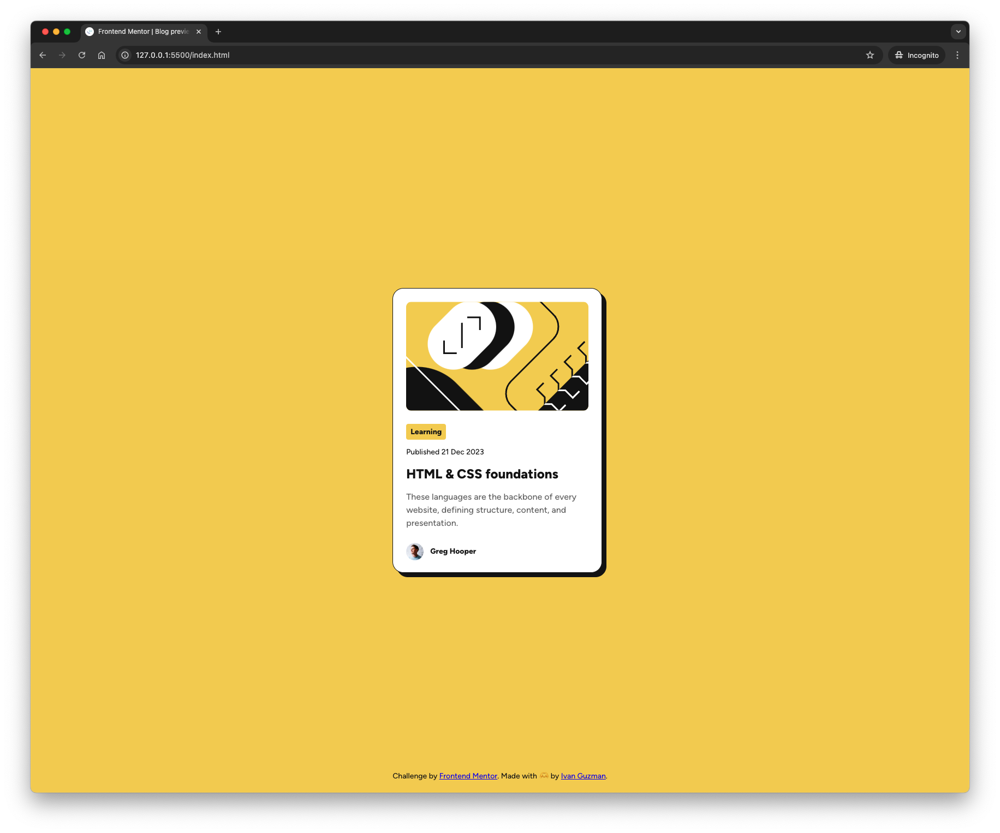

# Frontend Mentor - QR code component solution

This is a solution to the [QR code component challenge on Frontend Mentor](https://www.frontendmentor.io/challenges/qr-code-component-iux_sIO_H). Frontend Mentor challenges help you improve your coding skills by building realistic projects.

## Table of contents

- [Overview](#overview)
  - [Screenshot](#screenshot)
  - [Links](#links)
- [My process](#my-process)
  - [Built with](#built-with)
  - [What I learned](#what-i-learned)
  - [Continued development](#continued-development)
  - [Useful resources](#useful-resources)
- [Author](#author)

**Note: Delete this note and update the table of contents based on what sections you keep.**

## Overview

### Screenshot

#### Desktop Screenshot

#### Mobile Screenshot

### Links

- Solution URL: [Blog Preview Card](https://www.frontendmentor.io/solutions/blog-preview-card-krQ4_Z6mZx)
- Live Site URL: [GH Pages](https://ivngzmn.github.io/blog-preview-card/)

## My process

### Built with

- Semantic HTML5 markup
- CSS variables
- CSS Grid
- Mobile responsive

### What I learned

I learned more about box shadows and how simple they are to implement. Also learned to use relative links for assets such as fonts, image for correct deployment to GitHub pages.

### Continued development

TBD

### Useful resources

- [MDN](https://developer.mozilla.org/en-US/) - Always need MDN open in a new tab to ensure I am up to date on the latest CSS.

## Author

- Website - [ivanguzman.dev](ivanguzman.dev)
- Frontend Mentor - [@ivngzmn](https://www.frontendmentor.io/profile/ivngzmn)
- X/Twitter - [@inadequate_Dev](https://x.com/inadequate_Dev)
